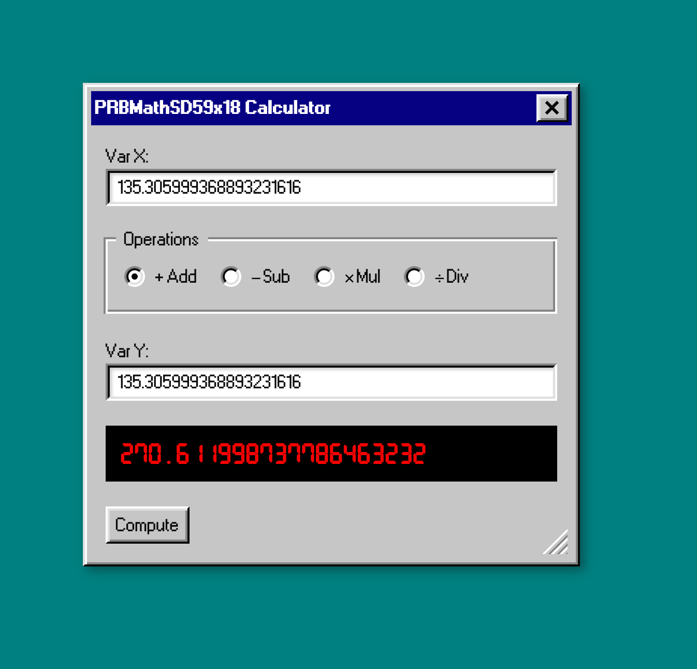

# Eth Calculator



<br />
<br />

Currently based on PRBMath

### Built With

* [ReactJS](https://reactjs.org/)
* [React95](https://react95.io/)
* [HardHat](https://hardhat.org)
* [PRBMath](https://github.com/hifi-finance/prb-math)

### Installing and running

Simply clone the repository

```
git clone git@github.com:enemycnt/eth-calculator-demo.git
```

then install dependencies

```
yarn install
```

run the hardhat node

```
npx hardhat node --watch
```

Let's move to frontend
```
cd frontend
yarn install 
```
and run our frontend 
```
yarn start
```

Open [http://localhost:3000](http://localhost:3000) with your browser to see the result.


